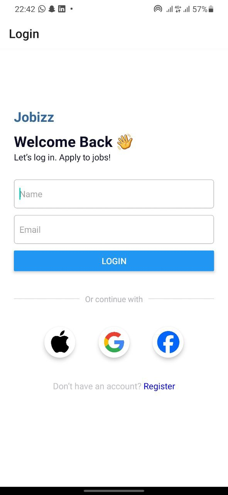

# Job Listing App

A React Native application that displays job listings in a vertically scrollable list. Each job card contains the company logo, job title, company name, amount to be paid, and location. 

## Features

- Search bar with icon and placeholder text.
- Vertically scrollable list of job cards.
- Customizable card styles.

## Screenshots




## Installation

1. Clone the repository:
    ```sh
    git clone https://github.com/codetozombie/rn-assignment4-11227686.git
    ```

2. Navigate to the project directory:
    ```sh
    rn-assignment4-11227686
    ```
    
3. Install the dependencies:
    ```sh
    npm install
    ```

## Running the App

### Android

Make sure you have an Android emulator running or an Android device connected, then run:
```sh
npx react-native run-android
```

### iOS
Make sure you have Xcode installed, then run:
```
npx react-native run-ios
```

### Expo
- Make sure to download the expo go app on your phone
- Make sure your phone and laptop are on the same network

```
npm start
```
- Open your phone's camera and scan the QR code


### Project Structure
1. App.js: Entry point of the application.
2. HomeScreen.js: Main screen displaying the job listings.
3. JobCard.js: Component for rendering individual job cards.
4. SearchBar.js: Search bar component.

5. assets/: Directory containing image assets.


### Dependencies
React Native
Expo Icons

### Contact 
If there is any issue do well to contact me 
My Email:  info.me.albert@gmail.com 